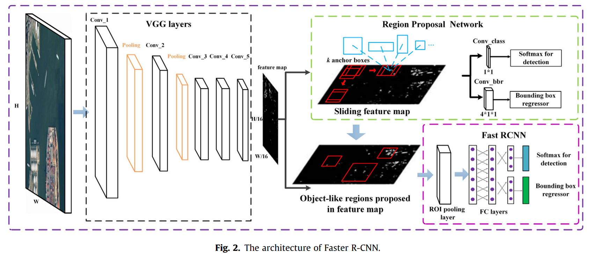

## Implementation [Faster RCNN](https://arxiv.org/pdf/1506.01497.pdf)
 
Image was taken from 
[article](https://www.researchgate.net/publication/324903264_Multi-scale_object_detection_in_remote_sensing_imagery_with_convolutional_neural_networks)

### `data` 
Consist of parsed [PASCAL VOC 2012](http://host.robots.ox.ac.uk/pascal/VOC/voc2012/index.html#devkit) annotation
in [csv-file](data/annotation.csv) and [parsing-code](data/parse_annotations.py)
### `model` 
* [RPN](model/rpn.py) - file with base Region Proposal Network implementation in pytorch

* [FastRCNN](model/FastRCNN.py) - file with base Fast-RCNN implementation in pytorch

* [FasterRCNN](model/FasterRCNN.py) - file with base Faster-RCNN implementation in pytorch

### `utils`
Consist of some utils files ([augmentations](utils/augmentations.py), [bbox_matcher](utils/bbox_matcher.py))

### `train`
Consist of some utils files for training ([dataloader](train/dataloader.py), [trainer](train/trainer.py))

